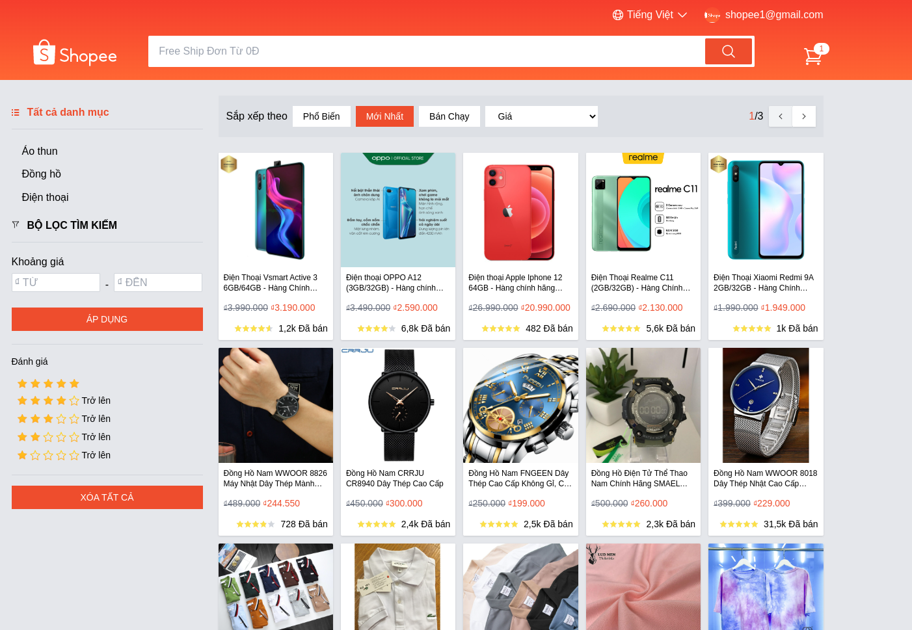
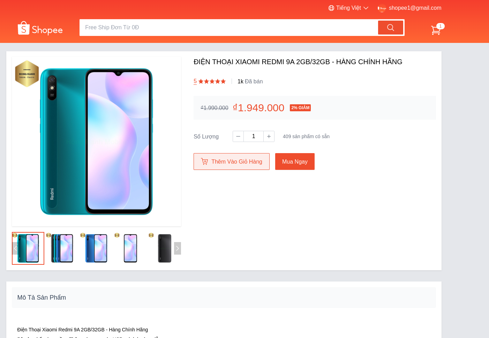
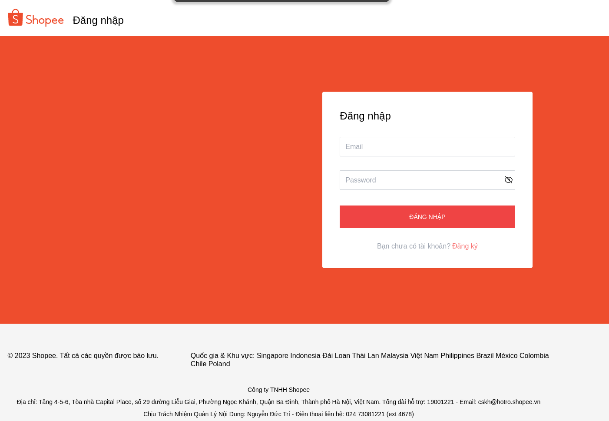
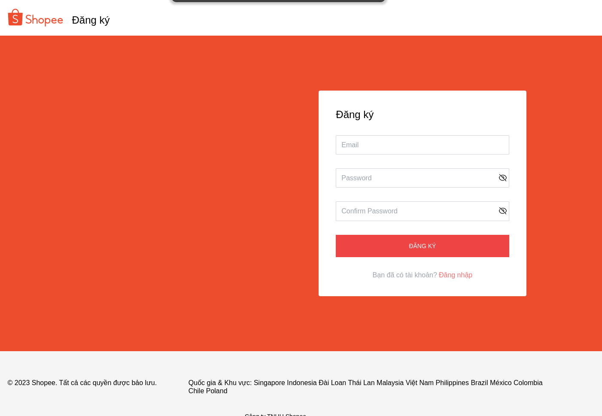
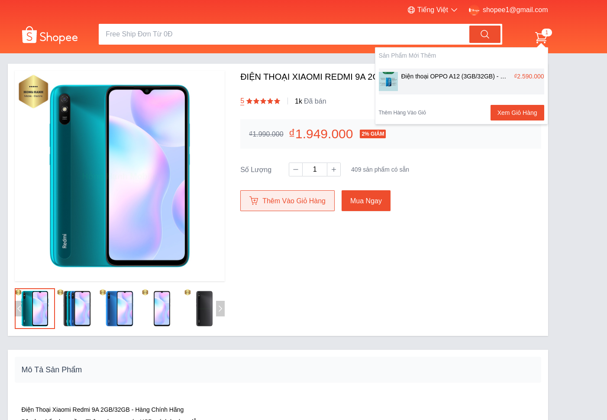
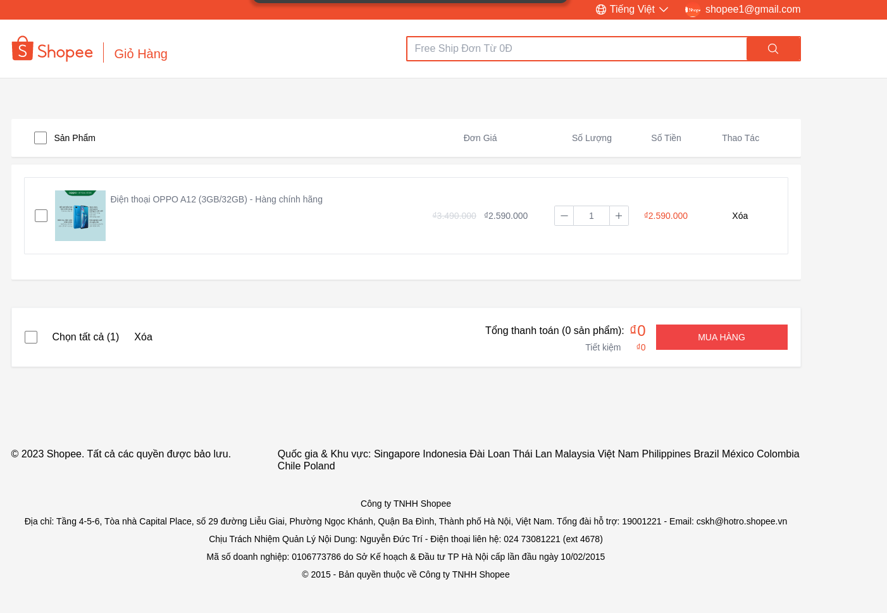
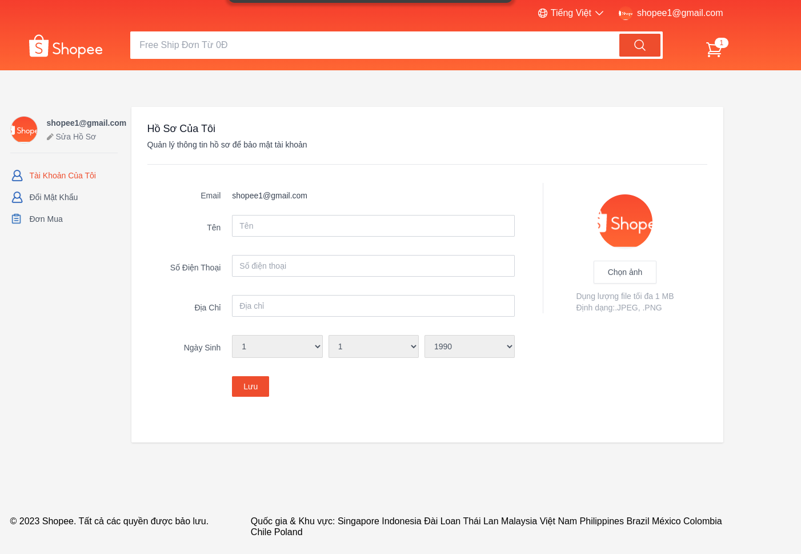
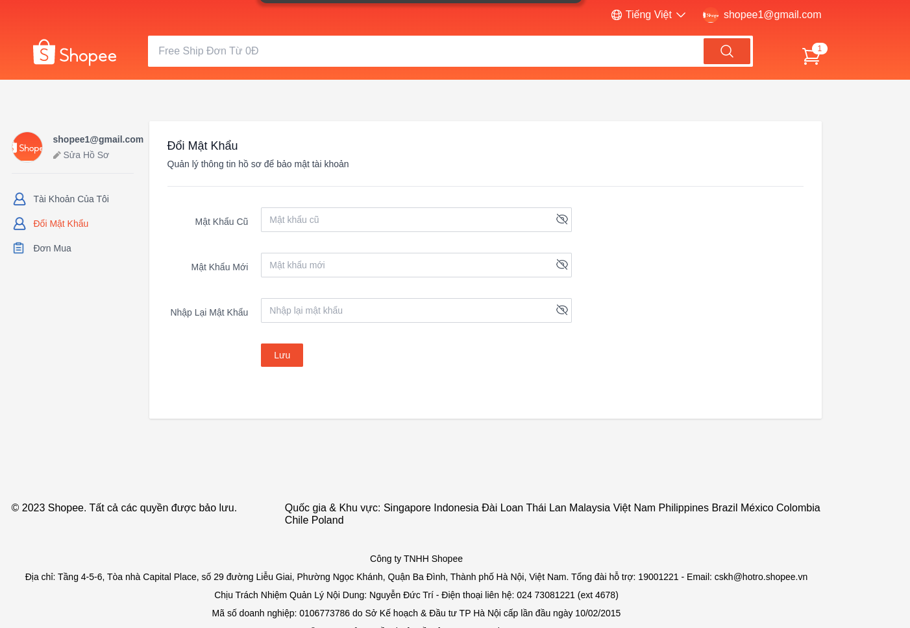
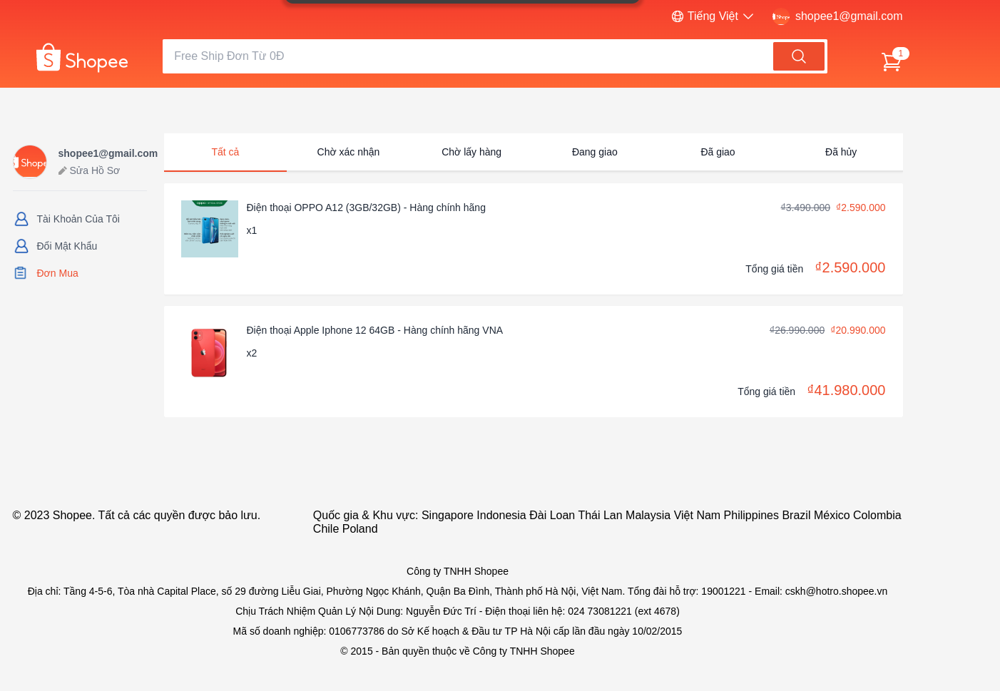

<p align="center">
  <a href="https://shopee.kd14.me/">
    
  </a>

  <h3 align="center">Shopee clone</h3>

  <p align="center">
    Clone shopee  <a href="https://shopee.vn/">shopee.vn</a> using Typescript
    <br>
    <a href="https://shopee.kd14.me/">Visit Website</a>

  </p>
</p>

## Table of contents

- [Website](#website)
- [Quick start](#quick-start)
- [Features](#bugs-and-feature-requests)
- [Demo](#demo)
- [Creators](#creators)
- [Thanks](#thanks)

## Website

Website link: [https://shopee.kd14.me/](https://shopee.kd14.me/)

---

## Quick start

Step 1: Add api link to `.env` file: `VITE_SHOPEE_CLONE_API_URL=xxxxx`

Step 2: You can get started with Shopee clone in minutes by running the following command:

```
 yarn && yarn dev
```

---

## Features

- User
  - Manage authentication with JWT (automatic token refresh applied)
  - My Account
    - Update info
    - View order history
    - Change Password,
    - Log out
- Cart: CRUD,
- Payment
- Products: filter, order, pagination,...

---

## Demo

Explore my Shopee clone website

|  |
| :----------------------------------: |
|           Homepage Screen            |

|  |
| :---------------------------------: |
|         Page detail Screen          |

|  |
| :-------------------------------: |
|           Login Screen            |

|  |
| :----------------------------------: |
|           Register Screen            |

View more ...

<details>
  <summary><code>Cart</code></summary>

|  |
| :------------------------------: |
|               Cart               |

</details>

<details>
  <summary><code>Payment Page</code></summary>

|  |
| :---------------------------------: |
|           Payment Screen            |

</details>

<details>
  <summary><code>User information</code></summary>

|  |
| :------------------------------: |
|     User information Screen      |

</details>

<details>
  <summary><code>Change Password</code></summary>

|  |
| :------------------------------------: |
|         Change Password Screen         |

</details>

<details>
  <summary><code>Order History</code></summary>

|  |
| :--------------------------------------: |
|           Order History Screen           |

</details>

and view more in [https://shopee.kd14.me/](https://shopee.kd14.me/)

## Creators

- <https://github.com/khanhduy-14>

## Thanks

Enjoy 🤘
